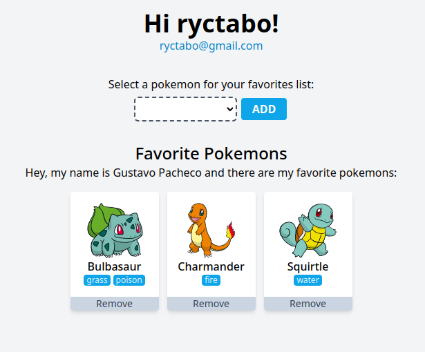

# Reto [Express & TypeScript]



El objetivo de esta prueba es evaluar tus habilidades y 
experiencia en el desarrollo backend utilizando Node.js 
y las tecnologías asociadas. Deberás implementar una API 
REST utilizando el framework Express y realizar las 
tareas descritas a continuación:

1. [X] Crear una ruta GET `/users` que devuelva la lista de 
usuarios almacenados en una base de datos en línea (usa 
la de tu preferencia te recomendamos crear una gratuita 
en https://www.mongodb.com/cloud/atlas).
2. [X] Implementar una ruta POST `/login` que permita 
autenticar a un usuario utilizando un nombre de usuario 
y una contraseña.
3. [X] Integrar la API con un servicio externo, Utiliza la 
[PokeAPI](https://pokeapi.co/docs/v2) para obtener 
información sobre los Pokémon.
4. [X] Crear una ruta POST `/users/favorites` que permita a 
un usuario agregar un Pokémon a su lista de favoritos.
5. [X] Crear una ruta GET `/users/favorites/{userId}` que 
devuelva la lista de Pokémon favoritos de un usuario.
6. [X] Realizar una app front básica con cualquier 
tecnología, framework u HTML/CSS/JS, que permita hacer 
uso de los endpoints realizados y visualizarlos de forma 
simple y básica.
7. [X] Deseable realizar los demas metodos de un Rest-Api 
restantes con `/users/favorites`

## Qué necesitas?

Necesitas tener instalado [docker](https://www.docker.com/).

## Como lo ejecutas?

Fácil, solamente tienes que ejecutar el siguiente comando y 
está funcionando.

```
docker compose up -d
```

---

## Modo desarrollador

Para trabajar en este proyecto debes tener instalado NodeJS
y una base de datos de MongoDB.

Luego ejecutar los siguientes comandos para poder instalar
dependencias.

```
npm install
```

Si no tienes instalado MongoDB en tu computadora, puedes usar
el siguiente comando de docker para usar un Mongo de 
manera rápida.

```
docker run -dp 27017:27017 --name mongodb mongo:latest
```

Luego para ejecutar el proyecto y detectar cambios debes 
ejecutar el siguiente comando:

```
npm run dev
```

Si quieres solamente compilar el proyecto debes ejecutar:

```
npm run build
```
